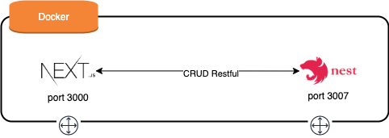
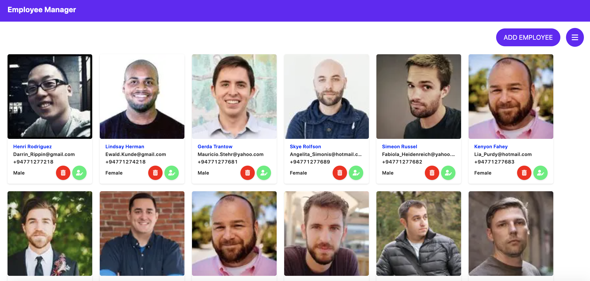
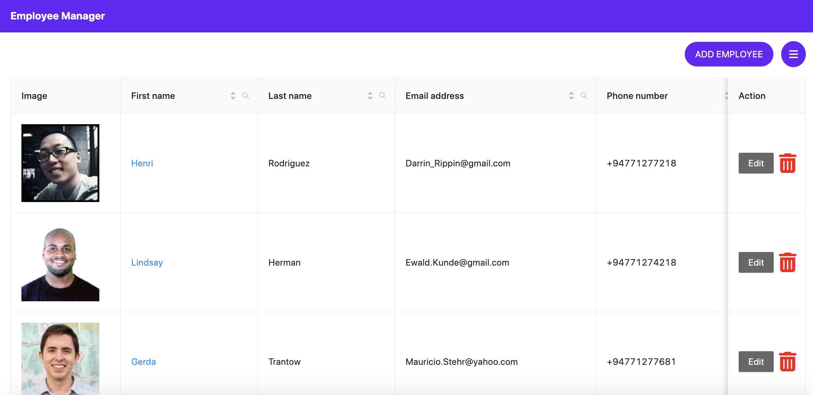
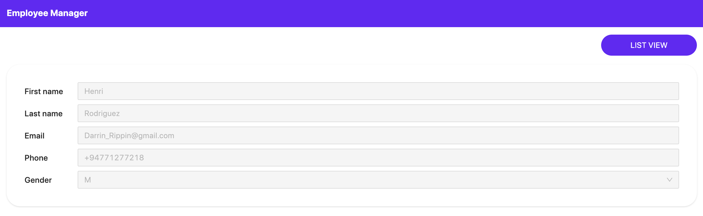
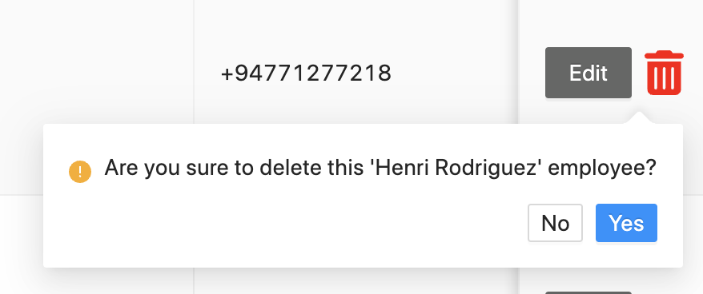
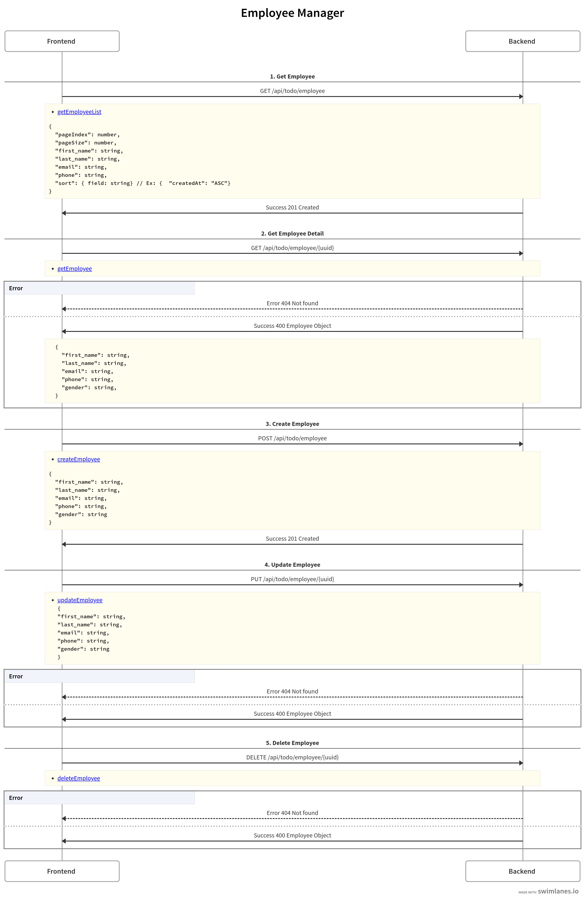

# Employer Manager

The employee-manager is a simple CRUD-based application to manage employees. 
Should use NextJS to make it support server-side rendering. 

- Need to create an endpoint to retrieve the data via a GET method using nextJS.

- Implement your own mechanism to persist the data in the front end. 

- Implement the standard validation for each CRUD operation. All the endpoints should available via NodeJS API and for that you can either use ExpressJS or NestJS to implement the API. 

- As a data source, you can either implement database connectivity with a relational or non-relation database.

**🚨🚨🚨 Please note: This is not a production-ready application**
## Getting Started

###  Architecture

**Technical Stack**

    - NestJs / TypeORM
    - NextJS
    - Postgres
    - Jest / Cypress
    - Additional: Husky / Pretty
### Prerequisites

What things you need to install

- Node.js v14.20
- yarn
- docker / docker-compose (optional)

### Installing
#### With Docker

    1. Clone the repository
    2. Build docker: `docker-compose build`
    3. Run docker image: `docker-compose up -d`

#### Without Docker

    1. Clone the repository
    2. Install Postgres ( should revise config folder files )
    3. Go to `backend` Directory
    4. Install dependencies: `yarn`
    5. Start service at port 3007: `yarn start:dev`
    6. Go to `frontend` Directory
    7. Install dependencies: `yarn`
    8. Start NextJs at port 3000: `yarn dev`

## Usage

- Swagger url: http://localhost:3007/docs/todo
- Main site: http://localhost:3000

## Running the tests

### Backend
    - Run yarn `test:cov`
    - Testing Coverage: > 80%

### Frontend
    - Run yarn `test:cov` for Unit Test
    - Run yarn `test:e2e` for e2e Test

## Screenshots

## Flow

## What next
- Improve UI Performance 
- Optimize Docker build
- Improve logging
- etc..